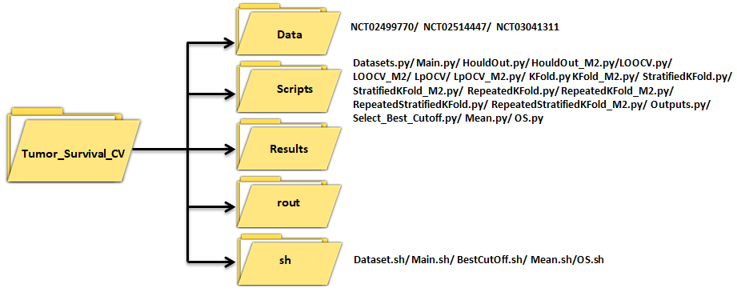
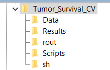

# Tumor_Survival_CV
---
## About The Project

This study confirms that the CV technique has significant impact on the accuracy of prediction probability of BOR. Thus, it is important to find and apply the optimal CV technique to build the predictive models. The results of this study shows, although, the datasets may have similar pre-processing, the same features, and data types but different size of data. The optimal CV technique to predict the probability of BOR is not the same. This study carried out to explore whether one specific CV technique can be get the most accurate predictions and segmentation of patients on clinical trials. In many previous studies, one specific CV technique was applied without explanations about the reasons of selection or testing other CV techniques. Using inappropriate CV technique can negative impact on the predictions and segmentations patients. It can be very vital in real clinical practice to predict the probability of clinical trials feature accurately. The results revealed that the best CV technique is uncertain in practice. Thus, it is important to try to consider the performance of different CV technique on clinical trials. In this study, a general model contains seven main CV techniques, in addition, the Nested CV technique were used to select the best prediction probability of BOR and segment the patients based on scores and best cut of that reached from the best performance of predictive models and then the CV technique were resulted in best performance were selected as the optimal CV technique. 

---
## Directory Layout


We assume the user set the default directory at **beluga** at Compute Canada
~~~
    [Tumor_Survival_CV]  
~~~
all codes are in the subdirectory directory at **Tumor_Survival_CV**
~~~
    [Tumor_Survival_CV]/Scripts 
~~~
all the .sh files that run the python files are in the subdirectory directory at **sh** 
~~~
    [Tumor_Survival_CV]/sh  
~~~
all the log files are in the subdirectory directory at **rout** 
~~~
    [Tumor_Survival_CV]/rout  
~~~
all the final results/intermedia results are in the subdirectory directory at **outputs**
~~~
    [Tumor_Survival_CV]/Results  
~~~
all the **data** from Schelker are stored at the directory bellow, which are accessible to all group members
~~~
    [Tumor_Survival_CV]/Data 
~~~

<details><summary>scripts</summary>

    ├── scripts  
    │ 	 ├── Datasets.py	# Making dataframes for building the predcitive models
    │ 	 ├── Main.py 		# main code using to build the predictive models 
    │ 	 ├── HouldOut.py	# import pkg_resources
    │ 	 ├── HouldOut_M2.py		# Build simulation using test and purified.h5ad 
    │ 	 ├── LOOCV.py			# Split data to train and test   
    │ 	 ├── LOOCV_M2.py		# import pkg_resources
    │ 	 ├── LpOCV.py			# Build simulation using test and purified.h5ad 
    │ 	 ├── LpOCV_M2.py		# Split data to train and test 
    │ 	 ├── KFold.py			# import pkg_resources
    │ 	 ├── KFold_M2.py		# Build simulation using test and purified.h5ad 
    │ 	 ├── StratifiedKFold.py			# Split data to train and test
    │ 	 ├── StratifiedKFold_M2.py		# Build simulation using test and purified.h5ad 
    │ 	 ├── RepeatedKFold.py			# Split data to train and test 
    │ 	 ├── RepeatedKFold_M2.py		# import pkg_resources
    │ 	 ├── RepeatedStratifiedKFold.py			# Build simulation using test and purified.h5ad 
    │ 	 ├── RepeatedStratifiedKFold_M2.py		# Split data to train and test
    │ 	 ├── Outputs.py			# Build simulation using test and purified.h5ad 
    │ 	 ├── Select_Best_Cutoff.py		# Split data to train and test
    │ 	 ├── Mean.py		# Split data to train and test
    │ 	 └── OS.py			# Predict the estimated proportion				
</details>
<details><summary>sh</summary>
    
    ├── sh  
    │ 	 ├── Dataset.sh		# sh.file to run Datasets.py
    │ 	 ├── Main.sh		# sh.file to run Main.py, HoldOut.py, HoldOut_M2, and ...
    │ 	 ├── BestCutOff.sh		# sh.file to run Select_Best_Cutoff.py
    │ 	 ├── Mean.sh		# sh.file to run Mean.py
    │ 	 └── OS.sh		# sh.file to run OS.py		
		
</details>
<details><summary>rout</summary>
        
    ├── rout  
    │ 	 ├── Dataset.sh		# log.file from Dataset.sh
    │ 	 ├── Main.sh		# log.file from Main.sh
    │ 	 ├── BestCutOff.sh		# log.file from BestCutOff.sh
    │ 	 ├── Mean.sh		# log.file from Mean.sh
    │ 	 └── OS.sh		# log.file from OS.sh	
	
</details>
<details><summary>outputs (final & intermedia results)</summary>

    ├──  intermedia result
    │ 	 ├── Coefs_NCT02499770.csv	# sh.file to run Datasets.py
    │ 	 ├── Coefs_NCT02514447.csv	# sh.file to run Main.py, HoldOut.py, HoldOut_M2, and ...
    │ 	 ├── Coefs_NCT03041311.csv	# sh.file to run Select_Best_Cutoff.py
    │ 	 ├── Best_Cutoff_NCT02499770.csv	# sh.file to run Mean.py
    │ 	 ├── Best_Cutoff_NCT02514447.csv	# sh.file to run Select_Best_Cutoff.py
    │ 	 ├── Best_Cutoff_NCT03041311.csv	# sh.file to run Select_Best_Cutoff.py
    ├──  final result     
    │ 	 ├── Performance_NCT02499770.csv	# 
    │ 	 ├── Performance_NCT02514447.csv	# sh.file to run Main.py, HoldOut.py, HoldOut_M2, and ...
    │ 	 ├── Performance_NCT03041311.csv	# sh.file to run Select_Best_Cutoff.py
    │ 	 ├── Result_NCT02499770.csv	# sh.file to run Mean.py
    │ 	 ├── Result_NCT02514447.csv	# sh.file to run Select_Best_Cutoff.py
    │ 	 ├── Result_NCT03041311.csv	# sh.file to run Select_Best_Cutoff.py
    │ 	 ├── Summary_NCT02499770.csv	# sh.file to run Main.py, HoldOut.py, HoldOut_M2, and ...
    │ 	 ├── Summary_NCT02514447.csv	# sh.file to run Select_Best_Cutoff.py
    │ 	 ├── Summary_NCT03041311.csv	# sh.file to run Mean.py
    │ 	 ├── Confusion_Matrix_NCT02499770.csv	# sh.file to run Mean.py
    │ 	 ├── Confusion_Matrix_NCT02514447.csv	# sh.file to run Select_Best_Cutoff.py
    │ 	 ├── Confusion_Matrix_NCT03041311.csv	# sh.file to run Select_Best_Cutoff.py
    │ 	 ├── Time_NCT02499770.csv	# sh.file to run Mean.py
    │ 	 ├── Time_NCT02514447.csv	# sh.file to run Select_Best_Cutoff.py
    │ 	 └── Time_NCT03041311.csv	# 
</details>
<details><summary>data</summary>
	    
    ├── data
    │ 	 ├── NCT02499770	# 
    │ 	 ├── NCT02514447	# 
    │ 	 └── NCT03041311	# 
 
</details>

---
## Notice

As all the processes are conducted using the relative path, it's very important to set up [Tumor_Survival_CV] and use it correctly. 
[Tumor_Survival_CV] should be consisted of three parts: part 1 is ```/project/6003851/``` to ensure all the files can run on Compute Canada; part 2 is your ```user name``` at Compute Canada; part 3 is your ```folder's name```. For example, the writer's directory is as follows:

~~~
/project/6003851/elhma/Tumor_Survival_CV
~~~

If you are not sure about the path of your working folder, try to type in 'pwd' command in linux or 'getwd()' in R language for reference. 

---
## Before you start
1. decide the path of [Tumor_Survival_CV] to replicate our results;
2. create the subdirectories **scripts**, **sh**, **rout**, and **outputs** at [DAISM]；
3. allocate all relevant files into each subdirectory. The **rout**, and **outputs** folders will be empty at the beginning while the **scripts** and **sh** folders should look like the figure below:



5. In the main directory [Tumor_Survival_CV], use the following commands to python/3.8  language in Compute Canada (The environment settings in CC change occasionally, make sure to check and use their latest settings):
~~~
module load python/3.8
~~~
4. before we run the .sh files, we use in the following commands in to install some packages needed for the task
~~~
pip install Cython
pip install pyreadstat
pip install sklearn
pip install numpy
pip install pandas
~~~

---

## Running files (estimated time per job)


<details><summary>1. Datasets.py (20 min)</summary>

- read annotation and Sc_RNAseq;

    - match the celltypes bewteen annotation and Sc_RNAseq;

    - build purified.h5ad;


 </details>
 
 ~~~
    sbatch ./sh/create_h5ad.sh
~~~


<details><summary>2.daism.py Generic_simulation (50 min)</summary>

- read the purified.h5ad;


</details>

~~~
    sbatch ./sh/simulation.sh
~~~


<details><summary>2.daism.py Generic_training (40 min)</summary>

- read the outputs of simulation module;

- split data to train, test and DAISM model;


</details>

~~~
    sbatch ./sh/training.sh
~~~

<details><summary>2.daism.py Generic_prediction </summary>

- read in the outputs of training moduel and test.txt;

- predict the estimated proportion;


</details>

~~~
    sbatch ./sh/prediction.sh
~~~


